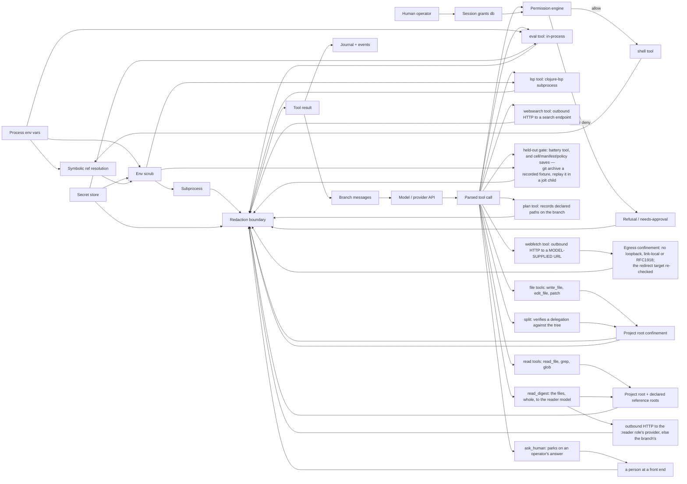

# RFC-003 — The security model

**Status:** implemented.

## Purpose

Specifies what contains the model, what deliberately does not, and the threat
model that makes that distinction coherent.

## Scope

**This layer decides** whether a command may run, and what a result may contain
by the time the model sees it.

**It must not decide** what to run. The permission engine is consulted; it does
not choose.

**It hands** an `allow`/`ask`/`deny` verdict to the shell tool, and redacted text
to whoever is returning a result.

### Threat model

**The model is trusted with in-process code execution.** `eval` runs arbitrary
Clojure in the harness process, and that is deliberate — it is the substrate the
mutation protocol is built on (RFC-002).

**Code the agent edits as data is not.** Cells (`resources/cells/*.clj` and a
project's copies), the policy tables' forms (`gates.edn` and `phases.edn`
`:when` / `:message-form` / `:measure` / `:finished-key`) and a manifest's
`(fn [d] ...)` dispatch predicates are rewritten by the agent while it runs,
and used to be `load-string`ed or `eval`ed into the harness compiler — so an
edited cell or rule had the whole process. They are evaluated in SCI now
(`samizdat.sandbox.sci`), against an allowlist that lives in `src/`: a cell
reaches the model, the run record and the tool path through the same
higher-level functions native code uses, and never a process, a file write,
raw SQL, FFI or host eval. The one command a cell may run is the run's own
configured check (`verify/run-configured`, sealed from the config the run was
started with). `eval` stays the deliberate in-process channel described above;
this boundary is about the code the agent persists into its own workflow.

So the secrets boundary protects against **accidental** leakage into the
transcript and the journal: a model prints a config map while debugging and a
provider key lands in the branch messages permanently. It does **not** protect
against a hostile model, because in-process execution cannot be contained from
inside the process. A model that wants a value out can encode it.

That limit is a statement of scope, not a gap to be closed later. Everything
below should be read against it.

## Model

Two layers, ported from dirge rather than reinvented: **secrets never enter
model space** (`samizdat.security.secrets`), and **every shell command faces a
policy decision before it runs** (`samizdat.security.policy`). The design rule
underneath both: the model *references* secrets and capabilities symbolically;
only the kernel ever touches values.

## Protocol

### Content flow

Every edge is "content flows to".

`ask_human` is the one node whose input never came off the machine: it puts a
question on an in-memory queue and waits, and what comes back is what a person
typed. It still passes through `redact`, for the same reason every other node
does — the boundary is about what reaches the model, not about whether the
source is trusted, and an operator can paste a secret into an answer as easily
as a file can contain one. Its reach is bounded by a deadline in gates.edn
(`:approval`), so it is a node that always terminates: an unattended run
resolves to the stated default rather than parking forever. Blocking is off
unless a project turns it on.

The `eval` node and its three edges were absent from this graph until this RFC
was written, which is how the property they violated stayed believed for four
review passes. `eval --> redact` is the fix (F1); before it, eval reached
`result` directly.

The `lsp` node repeated the omission: clojure-lsp was the one subprocess
spawned with the full parent environment (and it re-spawns children of its
own), and its file argument resolved with a bare `io/file`, outside the root
confinement every file tool enforces. Both fixed in the 2026-08 audit
(karamazov-blt.27, blt.28): it spawns through `scrub` and its paths go
through `resolve-under-root`; its replies were already inside the envelope
redaction.

`split` reads the tree to verify a delegation — the stubs the parent wrote and
the tests it sketched — so it is a read tool for confinement purposes even
though its only write is to the task board. It goes through
`resolve-under-root` rather than the wider read roots: a delegation is about
THIS project's own code, and a stub a child is told to fill has to be somewhere
that child can write.

**Reads and writes no longer share one boundary** (karamazov-1an). Writes keep
`resolve-under-root` unchanged: one root, canonicalized, fails closed. Reads go
through `resolve-for-read`, which admits the project root plus the READ-ONLY
reference roots the project declared in `.samizdat/config.edn`
(`:run :reference-paths`) — the operator's file, which the agent may not
rewrite, so the agent cannot widen its own read surface. Each declared root is
still canonicalized and a read outside all of them is still refused.

Splitting them makes the boundary WEAKER on paper and stronger in practice,
which is why it is written down here. The confinement it replaces did not
prevent the reads: run bd56a286's brief named a language reference and ~95
worked examples as required reading, both siblings of the root; `read_file`
refused them and the model read every one through `shell`, which spawns a
process. Forcing the narrow, paged, bounded tool to fail so the broad one gets
used protects nothing and costs the audit trail. `shell` remains the wider
capability and is unchanged by this.

Reading the load-bearing solid edges:

- **env reaches the subprocess only through scrub** (`env → scrub → sub`,
  `env → resolve → scrub → sub`): name-sensitive vars are stripped,
  value-shaped credentials replaced, before any spawn.
- **resolve feeds scrub, not the subprocess directly**: a `{{env/NAME}}`
  reference in tool args resolves at spawn time, and every value it resolves is
  added to the redaction known-values for that call — so even a subprocess that
  echoes the secret cannot get it past the boundary.
- **everything on the shell path that is model-bound passes redact**: subprocess
  output, refusal text. The journal is model-visible on resume, so it is inside
  the boundary, not outside it.
- **no path from toolcall to sub skips perm or scrub.**

### Tool output is data, and says so on the wire

Every tool result reaches the model inside `<tool_result tool="…">` …
`</tool_result>` (`message/frame-result`), with the only `</tool_result>` the
output itself contained escaped on the way in — so a file, a page or a
command's output cannot close the frame and speak as the harness. Harness
text (the context block, the one steer) is appended after the frame, and
`system.md` tells the model that anything inside it is what the tool
returned, never an instruction (karamazov-o4wm.3). A replayed row and a
forfeit handoff frame the same way; the harness's own rows are not framed,
because they are the thing the frame distinguishes from.

This is a defence against impersonation, not against persuasion: nothing
scans a page for advice the model might follow (dirge's `content_guard` does;
this harness does not), and the frame does not change a byte of the output
beyond the one escape.

## API

### `samizdat.security.secrets`

| fn | contract |
|---|---|
| `(sensitive-name? n)` | Whether an env var name is credential-shaped. |
| `(sensitive-value? v)` | Whether a value is a **high-confidence** credential shape. Long opaque base64 alone deliberately does not trip it: a false positive that redacts a build hash teaches the model that output is unreliable. |
| `(scrub-env env)` | The child environment: name-sensitive vars stripped, then any remaining var whose value is credential-shaped **or contains a stripped value** replaced. |
| `(scrubbed-process-env)` | `scrub-env` over the real environment. |
| `(stripped-values env)` | The values a scrub removed — what a subprocess could echo. |
| `(resolve-refs command env)` | `{{env/NAME}}` → the value, at spawn time. |
| `(refs-used command env)` | The values a command's refs resolved to. |
| `(known-values env [command])` | Everything this call must redact: stripped values ∪ resolved refs. **Returns a set.** |
| `(redact text [known-values])` | URL-userinfo and vendor-prefix tokens by regex, plus every known value by substring. Returns the text unchanged when nothing matched. |

### `samizdat.security.policy`

| fn | contract |
|---|---|
| `(decide command grants)` | `:allow`, `:ask` or `:deny` with the matching rule. |
| `(run-shell ctx command)` | **The chokepoint.** Permission, symbolic-ref resolution, scrubbed spawn, redacted output — the one place perm, scrub and redact meet. |

`(config/redacted m)` redacts a config map for the HTTP surface.

### `samizdat.security.exposure`

Which providers may see which files. The project's `.samizdat/config.edn`
names glob patterns per provider under `:run :provider-deny`, e.g.
`{:deepseek ["secrets/**" "**/*.pem"]}`. In config rather than `gates.edn`
because it confines the agent, and the run config is the file the file tools
and the shell policy refuse to let a run write.

| fn | contract |
|---|---|
| `(refusal ctx)` | The refusal text when a call's path argument (`:path`, `:file`, `:paths`) matches a pattern denied to a provider its result reaches: the branch's own, plus the `:reader` role's for `read_digest`. `run-tool` returns it as `:mechanics` before the tool runs. |
| `(visible ctx hits)` | grep's hits without those in denied files. |

## Rule tables

**Secrets and redaction** (dirge `src/sandbox/mod.rs`):

- `sensitive-env-name?` — name contains KEY/SECRET/TOKEN/PASSWORD/PASS/CRED/AUTH,
  minus a SAFE_EXACT list (PATH, HOME, SSH_AUTH_SOCK, …), plus explicit
  cloud-credential names.
- `sensitive-env-value?` — high-confidence credential shapes only: URL userinfo
  (`scheme://user:pass@`) and a vendor-prefix set (`sk-`, `sk-ant-api`, `AKIA`,
  `ghp_`, `github_pat_`, `hf_`, `xox[bpras]-`, `xai-`, `AIza`). Long opaque
  base64 alone deliberately does not trip it — a false positive that redacts a
  build hash teaches the model that output is unreliable.
- `scrub-env` — strip name-sensitive vars, collect their values, then replace
  any remaining var whose value is credential-shaped **or contains a known
  stripped value**.
- `redact` — URL-userinfo passwords and vendor-prefix tokens by regex, plus
  known secret values by substring.

**Shell permissions** (dirge `src/permission/`):

- Effects `allow | ask | deny`, most-restrictive-wins.
- Ordered rules, **last match wins**; shell-style globs; a trailing ` *` makes
  args optional.
- Hard denies (`rm -rf /**`, `dd **`, `mkfs **`). Interpreters (`python`,
  `node`, `npx`), `git push`, destructive git, package installs, `sudo`, and
  `curl`/`wget` are deliberately absent from the allow table: each asks.
- **Complex commands never ride an allow**: `$(…)`, backticks, `<(…)`, a
  subshell or arithmetic expansion becomes a whole-command claim, so
  `echo $(rm -rf ~)` cannot match `echo **`. Denies still apply.
- Allow rules match the command **raw** — `PATH=/tmp/evil git push` does not
  match a `git *` allow — while deny candidates additionally include the
  exec-prefix-stripped form, so `nohup rm -rf /` still hits `rm -rf /**`.
- Session grants persist scoped to the run and are consulted before the base
  rules. Human-only write (property 4).

## Invariants

| # | invariant | enforced by |
|---|---|---|
| 1 | Every path from `env` or `secrets` to `model`, `messages` or `journal` passes through `redact`. | `policy/run-shell` on the shell path, and the `scrubbed` wrapper in `tools/repl` on the eval path. Asserted by `secrets-test/spec-a-planted-canary-never-reaches-model-space` and `spec-eval-output-is-inside-the-redaction-boundary`. Covers accidental leakage only — see the threat model. |
| 2 | Every path from `toolcall` to `sub` passes through both `perm` and `scrub`. | `policy/run-shell` is the only spawn seam. `policy-test/spec-the-shell-tool-gates-every-command`. |
| 3 | `resolve` reaches nothing except through `scrub → sub`, and `sub`'s only outlet is `redact`. | `run-shell`'s structure. |
| 4 | `grants` are written only by a human. | The model has no edge into the grants table; the API's write path is human-only. The supervisor's `policy propose-grant` only ASKS: it drafts a narrow pattern (two literal words before any wildcard, matching a command this run was refused) and records it on a person's allow under `:block`; under `:refuse` it is journaled for the operator, never granted (karamazov-0e2c.20). |
| 5 | A complex command never rides an `allow`. | `policy/decide` promotes it to a whole-command claim. `policy-test/complex-commands-never-ride-an-allow`. |
| 7 | A `webfetch` never reaches loopback, link-local or an RFC1918 host, and never follows a redirect into one. | `webfetch/allowed?` on the request and again on the `location` header. Hardcoded in src on purpose, like invariant 6: a host list in agent-editable gates.edn could be widened by the party it confines. Known limit, stated rather than hidden — the check is string-shaped, so a public NAME that resolves to a private address is not caught; a DNS round trip inside a guard is a place where a slow resolver hangs the harness, and the redirect re-check is what covers the common case. |
| 6 | The run config (`.samizdat/config.edn`) — the ship-gate definition — is not writable by the run it gates. | `files/run-config?` refuses it in `write_file`/`edit_file`/`patch`; `policy/decide` hard-denies any shell statement naming it under a write-capable head (grants do not unlock it). Reads stay open. `files-test/the-run-config-is-not-writable-by-the-run-it-gates`, `policy-test/the-shell-cannot-mutate-the-run-config-either`. Hardcoded in src on purpose: a protected list in agent-editable gates.edn could be unprotected by the party it protects against (karamazov-kvw). |
| 8 | Nothing the agent spawns can connect to the harness's own listening ports (the HTTP API, the nREPL). | The eval image's seatbelt profile allows network INBOUND only; the shell's profile denies outbound to each port `security.listen` recorded (`(allow default)` plus a per-port deny is the one shape seatbelt honours — an allow of `localhost:*` overrides a later per-port deny). `image-test` (a listening socket stays unreachable from the image), `sandbox-test/a-sandboxed-shell-works-in-the-project-and-cannot-leave-it`. macOS only; see the known gaps for Linux (karamazov-3vu1.1). |
| 9 | The HTTP API serves only loopback Hosts and loopback Origins, and a request body must be `application/json`. | `server/refusal`. Closes the operator's own browser as the way in: a page could POST a text/plain body to 127.0.0.1 without a preflight, and a name rebinding to 127.0.0.1 read the answers as same-origin. `server-test/a-foreign-host-is-refused`, `a-cross-origin-request-is-refused`, `a-write-must-say-it-is-json` (karamazov-3vu1.1). |
| 10 | Every shell command runs under the OS sandbox: writes only in the project, its scratch, /tmp and the build caches; the secret regions unreadable; the project's `.samizdat/` read-only. | `confine/shell-command`, from `run-shell`. The allow table decides whether a command runs; this decides what it reaches — the table admits heads that run code the agent wrote (`make`, `jolt -e`). `policy-test/an-allowed-command-is-still-confined-by-the-os`. Setting in config.edn `:shell`, which no agent tool writes (karamazov-3vu1.5). |
| 11 | `.samizdat/` is not writable by anything the agent spawns, and a file-tool write to what confines the agent — the role map and the files serving `roles` and `phases` — is a person's call. | `confine/protected` in both sandbox profiles (spawned writes are not validated); `files/workflow-refused?` in write_file/edit_file/patch (asks under :block, allows under :yolo, refuses under :refuse). The rest of the workflow stays writable through the file tools, where every edit is validated before it runs (karamazov-3vu1.2). |
| 12 | The approval settings that loosen anything — `:on-timeout :allow`, `:mode :yolo` — come only from the operator's config.edn or a person's session mode. | `approval/policy`: gates.edn (agent-editable) may choose `:refuse`/`:block` and the wait, nothing else. `approval-test/the-agents-file-cannot-loosen-the-approval-policy`. |
| 13 | A read outside the project and its declared reference roots is a person's call. | `policy/outside-reads` turns a shell allow into an ask unless a grant allowed it; `files/resolve-read!` asks for read_file and read_digest. The secret regions stay refused to read_file even under yolo, since it runs in-process (karamazov-3vu1.3). |
| 14 | `{{env/NAME}}` resolves only names the operator listed (`:shell :env-refs`); GitHub tokens reach a child only by name (`:shell :pass-env`). | `secrets/refs-refused` in `run-shell` (deny before resolve); `secrets/scrub-env`'s `pass`. A reference let a model spend a key it could not read (karamazov-3vu1.4). |
| 15 | Agent-editable code — cells, policy-table forms, manifest dispatch forms — is evaluated only in SCI against `samizdat.sandbox.sci`'s allowlist, never by `load-string`/`eval` in the harness. A reference outside the list is refused at load, naming it. | `cells/load-cells!`, the `:cell` userspace validator and `mutation/propose-cell!` evaluate through `sandbox/eval-source!`; `gates`, `phases`, `state`, `tools.ship` and `symbolic.dispatch`/`maestro` compile through `sandbox/form-fn`. Hardcoded in src on purpose, like 6 and 7. `cells-sci-test`. Known limit: a cell still holds the ctx it is handed, so it can call an allowlisted function with a root or run-id of its choosing — `verify/run-configured` checks the command against the run's seal, `gitdiff` refuses an option-shaped revision, and `files/read-sources` stays under the root it is given. |
| 16 | A branch that has read web content (webfetch, websearch) runs only a read-only shell command, or one the operator's config names (`:run :verify-cmd`, an acceptance `:check`, exactly as written), without a person; one that has read outside the project (an approved outside read) sends nothing out — webfetch, websearch, or a shell command that is not read-only — without a person. Labels only narrow, per branch, and survive a resume. | `samizdat.security.flow` (table in src, like 6 and 7); `policy/with-flow` in `run-shell` and in the trace replay; `tools/run-tool`'s flow gate for the other sinks and its `observe!` for sources; `files/resolve-read!` and `run-shell` observe outside reads. Every change is a `:flow` journal note; `forget-run!` at run end. A gap turns an allow into an ask, settled by the approval policy like any other (yolo allows); the ask shows the call and its gaps, and offers no allow-always (karamazov-3vu1.7). `flow-test`. |
| 17 | A flow block says what is missing and the ways forward as data — `:gaps` and `:remedies` on the result's `:policy` and on the approval request — and the policy is pinned by trace files replayed against the real decisions. | `flow/remedies`; prompts/flow-blocked.md; `samizdat.security.replay`, test/policy/*.edn, `jolt policy-test` (karamazov-3vu1.8). `replay-test`. |
| 18 | Every HTTP API request but `/health` carries the bearer token this process issued; the token is written owner-only under `~/.config/samizdat/http/<port>.token`, inside the secret regions; and the nREPL listens only where both the shell and the eval image run under seatbelt, or the operator set `:nrepl {:unconfined :allow}`. | `security.token` (issued before the server listens, revoked on stop); `server/refusal` (no exemption for a request with no headers — HTTP/1.0 lets a raw socket send one); `api.client/auth-headers` and `api.sse` read the file per port; `core/nrepl-allowed?`. Closes invariant 8's Linux gap (karamazov-3vu1.11). `token-test`. |
| 19 | What one branch writes for another carries what the writer had read: a message, a task (created or edited), a memory (into later runs too) holds the writer's label in its `flow` column — the branch's when known, else the meet of every branch in the run. A branch that reads one on purpose takes it (the inbox, a task it claims, shows or lists, `recall`, another branch's turn through `fetch_turn`); a fork takes its parent's. What is put in front of a branch unasked leaves a labelled row's text out: the inbox preview withholds the body, and standing, learned-since, graduation candidates and the breadcrumb index skip labelled memories. | Migration v38; `flow/carried`, `run-label`, `receive!`, `inherit!`; `tasks/claim!` lowers the claimer; `beam/open-branch!` (karamazov-3vu1.13). `flow-carry-test`. |
| 20 | What the harness hands between branches carries labels as invariant 19's rows do: artifacts (the ledger withholds a labelled claim's text and keeps its line; the shared and crossover samples and the failures block leave labelled rows out; `fetch_artifact` takes the label), directives (an `intervene` carries the supervisor's label to the branch it reaches; a person's carries none), and files (a file tool's write by a labelled branch labels the file in `file_flow`, across runs; `read_file`, `read_digest`, a `grep` hit and a shell command that prints it take the label; a clean whole rewrite clears it). A branch opened on a problem other than the run's own, and the supervisor at every pass, takes the run's label. The workflow-editing actions (`cell`, `manifest`, `prompt`, `policy`, `adopt`) and `eval` in the harness's own image need trust; `eval` in a project image with network needs the audience. | Migration v39; `loop/ledger-block`, `flow/unlabelled`, `flow/wrote!`, `flow/read!`; `runs/open-branch!`; `tools/sink-of` (karamazov-3vu1.14). `flow-handoff-test`, test/policy/workflow-edits.edn. |

**A property is only as strong as the graph it is checked against.** Adding a
model-reachable tool means adding a node to the diagram above and extending the
canary test to its path — the `eval` node was missing for four review passes,
and a check cannot fail against a graph that omits its subject. Nothing
mechanical catches that omission.

## Known gaps

- ~~Redaction has one structural chokepoint (`run-shell`) and one wrapper
  (`tools/repl`); a future tool is outside the boundary by default.~~ Closed:
  `samizdat.agent.tools/run-tool` — the dispatch wrapper every tool result
  passes through — redacts the envelope (`:result`, `:artifact`, `:failure`)
  structurally, so a new tool is inside the boundary by default.
  `run-shell`'s scrub-before-spawn and the repl wrapper remain as the
  earlier, tighter layers on their paths.
- `sensitive-value?` covers named vendor prefixes. A credential with no
  recognisable shape is caught only by the substring pass, which requires the
  value to be in `known-values` — so a secret the harness never saw in the
  environment is not redactable.
- `:run :provider-deny` binds the path-argument tools, grep, and a shell
  statement that prints a file (`policy/read-paths`: cat, head, tail,
  `sed -n`). A statement that hides what it reads (a substitution, a
  script, a `cd` first) and `eval`'s `slurp` are not covered, so a model set
  on reading a denied file can still reach it; what it stops is the
  ordinary ways of reading carrying it to that provider.
- On LINUX the network is not confined: bwrap shares the host's network, and
  seccomp cannot tell a loopback connect from any other, so invariant 8 holds
  on macOS only — a Linux shell or image can CONNECT to the harness's ports.
  Invariant 18 makes that connection worth nothing: the API wants a token the
  process cannot read, and the nREPL is not listening unless the operator
  opted in. An nREPL on a unix socket the sandbox hides (which jolt.nrepl does
  not offer yet) would let it start there by default.
- The shell's network is open by design (git fetch, a dependency download),
  so a command the table allows can still send data out — a `jolt -e` that
  opens a socket. What stops a SECRET going with it is that the child never
  holds one (scrub-env, invariant 14) and the secret regions are unreadable
  (invariant 10). Data the agent READ is tracked by invariants 16, 19 and 20
  on the paths they name. What they do not see: a file written by the shell
  or by eval rather than the file tools (only the file tools label what they
  write, and a labelled branch's shell writes already need a person); a
  file read by a path `read-paths` cannot name; a side call's prompt (the
  critic, the judge), whose OUTPUT is covered because it becomes a task or a
  problem, which carry the run's label; and a shell command that reads
  outside through a substitution `outside-reads` cannot see.
- ~~Invariant 6 holds on the file-tool and shell paths only; `eval` and
  `jolt -e` can still `spit` the run config.~~ Closed by invariants 10 and 11:
  the project image and the shell both run with `.samizdat/` read-only. The
  supervisor's eval in the harness image is the exception, as it is for
  everything (see the threat model).
