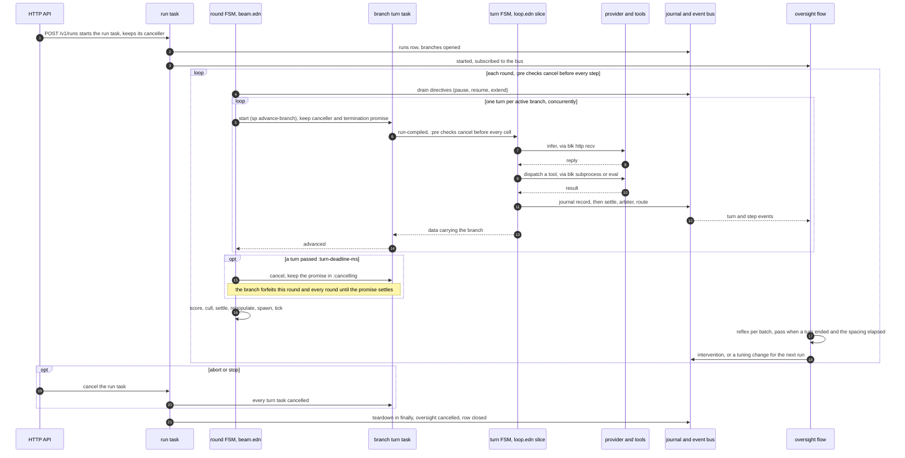
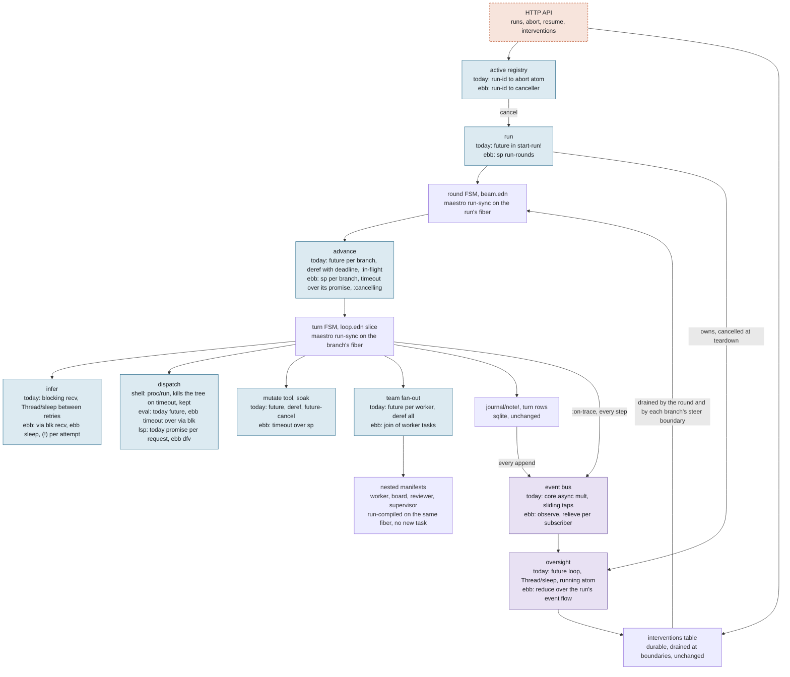
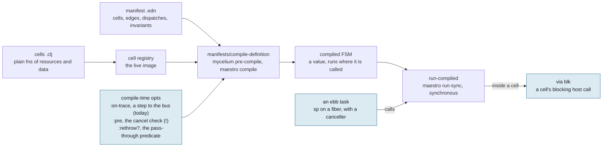
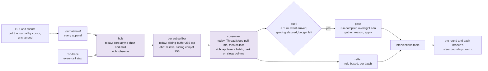
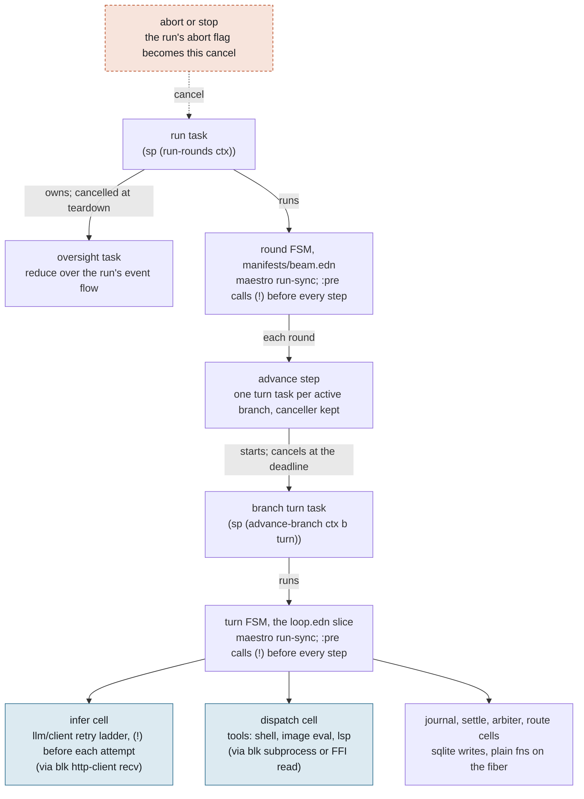
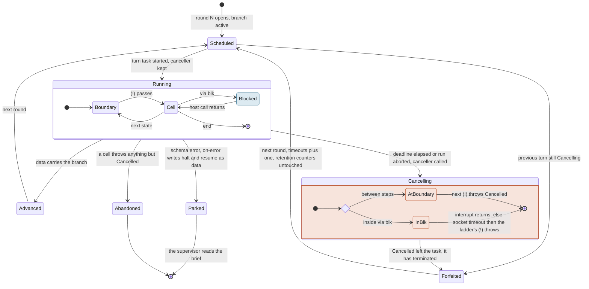
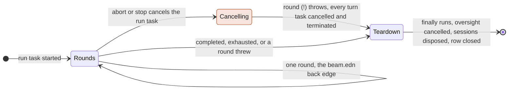

# RFC-013 — Concurrency: the task tree and the event flow

**Status:** draft, under review. Nothing below is implemented; the diagrams are
what the implementation follows. Tracked as epic `karamazov-3cll`.

## Purpose

Specifies where the harness waits and what can stop it. Samizdat runs two
streams (RFC-012): the implementer, which owns the task, and the supervisor,
which owns the loop's health. Both are mycelium manifests driven by the same
maestro step loop. Around them sit the places the harness waits: a provider
socket, a subprocess, a sleep, a sibling branch, an event bus. Today each is a
`future`, a `promise`, an atom, or a core.async channel, and none can be told
to stop. A branch turn past its deadline runs to completion, journaling under
the branch, and the beam remembers it so the branch is never advanced beside
its own zombie (`advance-all`'s `:in-flight`, provenance blt.18).

This RFC adopts [ebb](https://github.com/jlt-commons/ebb) for two things.
**Tasks** for everything that produces one value and may be cancelled: the
run, a branch turn, a provider call, a soak. **Flows** for the one place that
produces many values: the event bus the supervisor watches. Mycelium stays
what it is, a state machine that runs wherever it is called. Ebb decides where
that is and what can stop it.

## Scope

**The base decides nothing new.** Cancellation is mechanism: ebb is a `src/`
dependency, the cancel check is a `:pre` interceptor on the FSM loop that
already runs every turn, and every deadline stays where it is
(`gates.edn :turn-deadline-ms`, the provider socket timeout, tool timeouts,
the `:oversight` policy).

**Mycelium is the machine, ebb is the scheduler.** Mycelium and maestro import
nothing from ebb. Three compile-time options on `manifests/compile-definition`
are the whole seam: `:on-trace` (exists today), `:pre`, `:rethrow?`.

**Cells do not learn a new API.** A cell is still a plain function of
`(resources data)`. What changes for a cell author is two rules: no raw
`future` under `resources/cells`, and a blocking host call goes under
`via blk`.

**It must not conflate two words.** `samizdat.park` is a workflow halted as
data for the supervisor (`:mycelium/halt`, `:mycelium/resume`). An ebb park is
a fiber suspended at a wait. A cancelled turn is neither halted nor errored.

**Only observation is a flow.** The bus and its consumers are flows. The turn,
the round and the run are tasks. Interventions stay a table.

## Model

### The loop end to end

One run, from the HTTP call to the closed row. The loop repeats per round;
inside it every active branch takes one turn. The supervisor runs beside the
loop, not inside it, and its only way back in is the interventions table.

What changes from today is small in this picture: the run and each turn are
tasks with a canceller, the deadline is a cancel instead of a deref timeout,
and abort is the same cancel from outside. Everything the supervisor does, and
everything the journal records, is where it already is.

### Where the concurrency is

The same loop as a topology. Plain nodes are synchronous code that does not
change. Tinted nodes are the places the harness waits, each labelled with what
it is today and what it becomes (blue: a task or a blocking host call under
`via blk`; violet: a flow; dashed: an external cancel).

Every task node hangs off the run task, so cancelling the run cancels all of
them. The nested manifests need nothing: they run on the fiber that called
them, and ebb's cancel check (`ebb.impl.affine/check`) reads a process-local,
so a check inside a worker loop sees the enclosing turn's cancellation.

### Where mycelium meets ebb

Mycelium compiles a manifest and its cells into a maestro state machine, and
running that machine is a synchronous function call. Mycelium never spawns
anything and never imports ebb.

| opt | exists | what it is |
|---|---|---|
| `:on-trace` | today | mycelium's per-cell callback; `events/tracer` publishes a step per cell to the bus (RFC-012) |
| `:pre` | today in mycelium (`mycelium.core/pre-compile`), unused by samizdat | the per-step interceptor maestro calls before every step, outside every catch. Samizdat passes one that calls ebb's check `(!)`, so a `Cancelled` thrown there leaves the loop clean |
| `:rethrow?` | new, a divergence recorded in the registry | a predicate every catch on the FSM path consults before treating a throwable as a cell error: maestro `normalize-handler`, mycelium `wrap-handler-with-error-catch`, the resilience executors, join members. Samizdat passes `ebb/cancelled?` |

### The supervisor as a flow

The bus has two invariants written in its docstring (`samizdat.events`): a
publisher never stalls, and a slow watcher loses events rather than applying
backpressure. Those are ebb's `observe` and `relieve`, so the flow version
keeps the contract by construction rather than by a buffer size.

The consumer is one task: `reduce` over the batches, whose accumulator is the
state `oversight/start!` keeps today (`:passes`, `:last-at`, `:carry`). It is
a child of the run task and is cancelled at teardown, which replaces the
running atom and the `future-cancel`. The poll interval survives as the park
between batches, so a batch is still everything that arrived in one interval
and `gates.edn :oversight :poll-ms` keeps its meaning.

### Every wait, today and after

| where | today | with ebb | child |
|---|---|---|---|
| `api/control start-run!` | future, abort atom, `active` registry of atoms | run task started with callbacks; the registry holds the canceller; `abort!` calls it | 3cll.2 |
| `beam run-rounds` | runs the round manifest on the future's thread; `finally` tears down | the same, inside the run task; the `finally` is unchanged | 3cll.2 |
| `beam.edn` round FSM | maestro `run-sync` | the same, plus a `:pre` that checks cancel before every step | 3cll.4 |
| `beam wait-while-paused` | `Thread/sleep`, abort flag polled | ebb sleep, cancel check | 3cll.4 |
| `beam advance-all` | future per branch, deref with deadline, `:in-flight` atom of zombies | sp per branch with a termination promise; `timeout` over the promise; `:cancelling` holds cancelled tasks until they stop | 3cll.2 |
| `loop.edn` turn FSM | maestro `run-sync` | the same, plus the `:pre` check; every cell boundary is a cancel point between journal writes | 3cll.4 |
| `llm/client` | blocking recv; `Thread/sleep` between retries; abort flag checked | `via blk` recv; ebb sleep; cancel check before each attempt and before the retry note | 3cll.4 |
| `llm/ratelimit` | "never sleep here", because a sleep cannot be cancelled | the rule dissolves; the docstring says so | 3cll.4 |
| `engine/proc run` | `waitFor` with timeout, kills the process tree | kept; a cancel takes the same kill path | 3cll.3 |
| `repl eval-code` | future, deref, `future-cancel` best effort | `timeout` over `via blk` | 3cll.3 |
| `repl/route` image eval | future, deref, restart the image on timeout | `timeout` over `via blk`; the restart stays if the FFI read is un-interruptible | 3cll.3 |
| `mutation` soak | future, deref, `future-cancel` best effort | `timeout` over sp | 3cll.3 |
| `cells/team` fan-out | future per worker, deref all | `join` of worker tasks; workers already return rather than throw, so a join never fails early | 3cll.2 |
| nested manifests | `run-compiled` inside a cell, same thread | unchanged; the check reads a process-local, so nesting inherits cancellation | none |
| `oversight start!` | future loop, `Thread/sleep`, running atom, `future-cancel`, `collect` per poll | `reduce` over `ap` over `relieve` over `observe`; a child of the run task, cancelled at teardown | 3cll.9 |
| `events` hub | core.async chan, mult, sliding-buffer taps | `observe`, `relieve` per subscriber with a sliding conj | 3cll.9 |
| `lsp/client` | reader future, promise per request | `dfv` per request; the reader under `via blk` | 3cll.8 |
| maestro and mycelium catches | `catch Throwable` routes everything to the error state | consult `:rethrow?` first; Cancelled passes through | 3cll.4 |
| mycelium async, join, timeouts, resilience | three promise idioms, an abandoned thread, futures per member; unused by any manifest | unified over tasks, as a follow-on | 3cll.8 |

### What does not change

- **Manifests and cells.** Every `.edn` under `resources/manifests` and every
  cell keeps its shape. A cell author learns two rules, not an API.
- **The interventions table.** Durable, with pending versus applied stored
  rather than inferred, drained at boundaries. A mailbox would lose that
  honesty, so it stays a table.
- **The journal and the events table.** Sqlite writes on the calling fiber.
  The bus is a tap on the journal, not a replacement for it.
- **Clients.** The GUI and the API read the journal by cursor. A live event
  endpoint becomes possible once the bus is a flow, and is not part of this
  work.
- **Resume.** Rebuilds branches by replay and re-enters `run-rounds`. It gets a
  run task like a fresh start does.
- **Every number.** The turn deadline, the socket timeout, tool timeouts, the
  oversight spacing and poll interval, the pause poll. All in `gates.edn` or on
  the tool, none in code.

## Cancellation

### The tree

Every arrow is ownership; cancelling a node cancels everything under it. The
two tinted cells are the only places a fiber hands work to a real thread,
because those host calls block.

### One branch turn

The state machine the implementation follows. `Running` is the turn manifest
stepping through its cells; four exits leave it and only one is `Cancelled`.

**The detach decision** is the edge from `Scheduled` straight to `Forfeited`.
ebb's combinators are structured: `timeout` is `any` over the task and a
sleep, and `any` settles only when every child has terminated, cancelled ones
included (`ebb.impl.race-join/terminated`). If the beam parked on the
cancelled turn, its round barrier would stall on every un-interruptible read,
which is the stall `:turn-deadline-ms` exists to prevent. So the beam starts
the turn task with its own callbacks, keeps the canceller and a termination
promise, cancels at the deadline, and moves on. The branch forfeits each round
while the promise is unsettled. That is today's in-flight registry with one
difference that matters: the entry is a task that has been told to stop and
will at its next check, not a thread running to completion. The bound on
`Cancelling` is the innermost blocking wait.

### The run

The abort flag checked at the top of each round (`wait-while-paused`) and
between retry attempts (`llm/client`) becomes one cancel of the run task. The
round FSM's `:pre` throws at the next step, which cancels the advance step's
turn tasks under it. Teardown is `run-rounds`'s existing `finally`.

### The four exits of a turn

| exit | carried as | the beam does | journal after it |
|---|---|---|---|
| Advanced | data with `:branch` | records the turn, branch stays active | none, the turn is complete |
| Parked | data with `:mycelium/halt` and `:mycelium/resume` | hands the brief to the supervisor | none |
| Abandoned | a thrown exception, not `Cancelled` | branch abandoned with the message | none |
| Forfeited | `Cancelled`, passed through every catch | timeouts plus one, the deadline message, retention counters untouched | none, because `:pre` runs before every writing cell |

## Invariants

- **Mycelium and maestro import nothing from ebb.** The three compile-time
  options are the whole seam. *Enforced by* a base-test ratchet that fails on
  an ebb require under `src/mycelium` or `src/maestro`.
- **Cancelled is not an error.** Every catch on the FSM path consults
  `:rethrow?` before treating a throwable as a cell error: maestro
  `normalize-handler` (`src/maestro/core.clj:40`), mycelium
  `wrap-handler-with-error-catch` and the resilience executors, join members,
  `advance-all`'s own catch, feature's `safely`. *Enforced by* a test that
  throws `Cancelled` from inside a cell and asserts the turn task terminates
  with it and the FSM never reached `::error`.
- **Cancelled is not halt.** A cancelled turn never produces `:mycelium/halt`.
  *Enforced by* the same test asserting no `:mycelium/resume` in the result.
- **A branch is never advanced beside its own turn.** *Enforced by* the
  termination promise: `advance-all` forfeits a branch whose previous turn is
  still `Cancelling` (today's `control_test` 672, restated).
- **No journal write after a forfeit.** *Enforced by* `:pre` preceding every
  cell, and by the retry ladder checking `(!)` before each attempt and before
  its `:turn-retry` note. This is the invariant the interleaving model in
  `karamazov-3cll.5` proves over every schedule.
- **The publisher never parks.** The bus is `observe` and each subscriber sits
  behind `relieve`. *Enforced by* construction; a test publishes past a
  subscriber that never takes and asserts the publisher returned.
- **Only observation is a flow.** *Unenforced*: a convention, named here.
- **A blocking host call goes under `via blk`.** Provider recv, subprocesses,
  the image FFI read, the LSP reader; nothing else. *Unenforced*: a
  convention, named here so it is not mistaken for more.
- **No raw `future` under `resources/cells`.** *Enforced by* a base-test
  ratchet. The team fan-out (`cells/team.clj`) becomes a `join`.
- **Numbers stay in resources.** *Enforced by* review; there is no constant to
  add.

### Rules for code that parks (ebb ADR-001)

Ebb's `doc/adr/001-fiber-affinity.md` states six disciplines for code on jolt
fibers. Four of them are landmines for samizdat code the moment it parks, and
they hold for `src/` and for cells alike:

- **Never park inside a lazy sequence.** Realizing a lazy seq takes a counted
  lock, and a fiber cannot leave the CPU while its carrier holds one, so a
  `?`, `sleep`, `via blk`, `join` or `timeout` inside a `map`, `for`,
  `filter`, `keep`, `mapcat`, `lazy-seq`, `iterate` or `repeatedly` body is a
  hang, not an error. Loops that park are `loop/recur`, `mapv`, `doseq`,
  `reduce`, `run!`. *Enforced by* the base-test ratchet
  `no-park-inside-a-lazy-body` over `src/` and `resources/cells`.
- **A continuation is bound to (thread, fiber), not fiber alone.** A timer
  thread can resume a main-thread continuation undetected. Never move a task's
  continuation across OS threads by hand; ebb's executors do it. *Unenforced*:
  there is nothing in samizdat that could, and the rule is here so nothing
  starts to.
- **`finally` runs twice under a re-entered continuation.** `dynamic-wind`
  after-thunks re-run, so a `finally` that lexically contains a fork point
  (`ap`, `cp`) must be idempotent. `sp` bodies are safe. *Unenforced*:
  samizdat uses no `ap` or `cp` on the implementer path; the bus consumer
  (3cll.9) keeps its `finally` out of the `ap` body.
- **Bindings do not cross fibers.** Ambient context is snapshotted and carried
  by the handshake, not inherited, so a dynamic var bound on the caller is not
  visible inside `via blk`. Pass what a blocking call needs as arguments.
  *Enforced by* the spike's row for the nested check (`*process*` is carried);
  for everything else, review.

Two measured facts sit beside the rules: an `sp` runs its body on the caller
until the first park and only then returns its canceller, and `via blk`
delivers whatever the thunk produced and never substitutes `Cancelled`, so
`(!)` follows every `via blk` return (the spike's answer, above).

## The spike's answer (karamazov-3cll.1, measured 2026-09-06)

The question was whether jolt's thread interrupt unblocks a `:blocking` FFI
read. **It does not.** Measured with `dev/samizdat/dev/ebb_spike.clj` on jolt
0.8.3, cancel at 500 ms, socket timeout and sleeps at 5 s; each wait under ebb
`via blk` (whose cancel interrupts the thread) and under a jolt `future` +
`future-cancel` (what the code does today):

| wait | after cancel, under ebb | under future-cancel |
|---|---|---|
| http-client recv (`:blocking` FFI) | blocked until SO_RCVTIMEO fired, 4499 ms; `SocketTimeoutException` delivered, not Cancelled | same, 4503 ms |
| nrepl transport recv (`:blocking` FFI) | blocked until SO_RCVTIMEO, 4498 ms; returned `nil` and the body **ran on** | same |
| `Thread/sleep` | 1 ms, `InterruptedException` | 1 ms |
| ebb `sleep` on the fiber | 0 ms, Cancelled | n/a |
| promise deref | 0 ms, `InterruptedException` | 0 ms |
| subprocess `waitFor` | 27 ms; `waitFor` returned, `proc/run` reaped the tree, `{:timeout true}` | 17 ms |
| tight loop, no check | never | never |
| loop checking `isInterrupted` | 0 ms | |
| sp loop with `(!)` and a 1 ms park | 0 ms, Cancelled | |
| `(!)` inside a called fn, nested in sp | 0 ms, Cancelled | |
| sp invocation with 300 ms of CPU before its first park | the canceller came back after 300 ms | |
| `(timeout (via blk (Thread/sleep 5s)) 500)` | settled at 504 ms | |
| `(timeout (via blk (http recv 5s)) 500)` | settled at 5002 ms: **the parent waited for the child** | |

Ebb's own suite passed under jolt 0.8.3 (283 tests, 1199 assertions, 0
failures); requiring `ebb.core` costs ~60 ms of boot, warm. `jolt build` of
the spike harness (which requires ebb) produced a binary whose table matched
the interpreted run line for line, so ebb survives AOT; the harness binary
itself built and booted with the dependency declared, and ebb enters it the
day `src/` first requires it.

**What follows, and where it lands.**

- `Cancelling` lasts up to the innermost blocking read. For the provider that
  is `:socket-timeout` (300000 ms today). For the project image it is
  **forever**: `repl/image.clj` connects with no `:recv-timeout-secs`, which
  is why `repl/route.clj` kills the image on a deadline. The nrepl dep ships
  an `interrupt` op that aborts a CPU-bound eval at its next check; child
  3cll.3 sends it on cancel and sets a receive timeout, keeping the kill only
  for an eval blocked in a foreign call. The detach decision above stands and
  is now measured, not argued.
- `via blk` delivers what the thunk produced: an `InterruptedException`, a
  `SocketTimeoutException`, or a value (the nrepl recv returned `nil` and the
  body kept going). It never substitutes Cancelled. So child 3cll.4 calls
  `(!)` immediately after every `via blk` returns, and `:rethrow?` accepts
  `InterruptedException` as well as Cancelled.
- An `sp` runs its body on the invoking fiber until the body's first park.
  A turn's assemble and compaction run before the turn task hands back its
  canceller, and five branches serialize that prefix on the round's fiber.
  Child 3cll.2 measures the prefix on a real turn and, if it matters, starts
  each turn task from `via cpu` so the prefix runs off the round's fiber.
- A cancel *can* reach a blocking read in the two libraries we own:
  http-client and the nrepl transport could read in `poll` slices and check
  the interrupt between slices, or jolt's `interrupt!` could signal the target
  thread so the syscall returns `EINTR`. That is `karamazov-3cll.10`, and when
  it lands `Cancelling` shrinks to one slice.
- The lazy-seq audit (ADR-001 rule 5) found no park inside a lazy body on the
  turn path: maestro's loop is `loop/recur`, cells are called directly, the
  team fan-out uses `mapv`, and mycelium's lazy forms are compile-time. Child
  3cll.7's ratchet is the durable check.

## What this RFC does not cover

Mycelium's async cell protocol, `join` and graph-level `:timeouts` are not used
by any samizdat manifest and are not on the turn path. Unifying them over
tasks is `karamazov-3cll.8`, a follow-on, and does not change these diagrams.
A live event endpoint for clients is enabled by the bus becoming a flow and is
not specified here.
